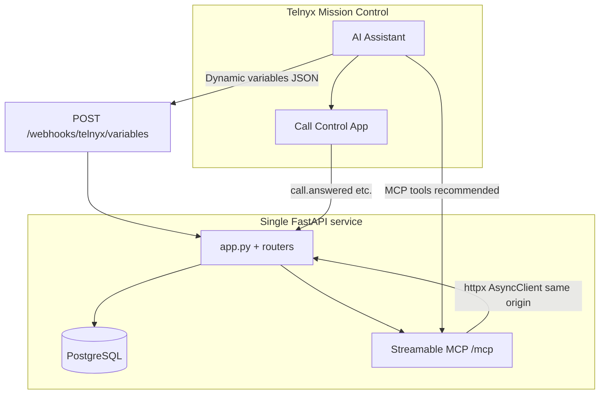

# Telnyx Voice AI — Hanok Table (Restaurant Reservations)

> **Telnyx challenge stack:** Voice AI assistant for **Hanok Table** (demo Korean restaurant), backed by **FastAPI**, **PostgreSQL**, **dynamic webhook variables**, **Call Control** outbound reminders, and an in-repo **MCP server** that wraps the same REST API. For deploy-specific Telnyx + Render steps, see [`telnyx_restaurant/mcp_server/README.md`](telnyx_restaurant/mcp_server/README.md).

[](https://developers.telnyx.com/)
[](https://modelcontextprotocol.io/)
[](https://fastapi.tiangolo.com/)
[](https://render.com/)
[](https://www.python.org/)
[](LICENSE)

---

## Overview

This repository is a **single Python service** (`telnyx_restaurant`) that:

- Exposes a **REST API** for reservations (create, lookup, partial update, status/cancel) with **menu-backed pre-orders** and pricing.
- Serves **Telnyx webhooks**: dynamic **variables** for assistant instructions (`locale_hint`, reservation summaries, premium-guest hints) and **Call Control** callbacks for outbound reminder TTS.
- Mounts **Streamable HTTP MCP** on the same uvicorn process when enabled (`HANOK_MCP_HTTP_MOUNT=1`) so Telnyx can use **`https://<host>/mcp/`** without a separate MCP worker.
- Serves a **static site** (landing EN/KO, reserve-online, reservation status) and a **server-rendered admin calendar** (non-cancelled bookings; **times shown in Pacific / configurable display TZ**).

**Time semantics:** `starts_at` is stored in **UTC**. Values **with** an explicit offset (`Z`, `-07:00`, …) keep their meaning. **Naive** ISO strings (e.g. `2026-03-30T18:00:00` from voice tools) are interpreted as **restaurant wall time** (`HANOK_RESERVATION_WALL_TIMEZONE` or `HANOK_ADMIN_DISPLAY_TIMEZONE`, default `America/Los_Angeles`), not as UTC.

**Locale:** `preferred_locale` (`en` / `ko`) on each reservation drives **`locale_hint`** (`en-US` / `ko-KR`) from **`POST /webhooks/telnyx/variables`** when the caller matches a DB row. The landing-page language toggle alone does not reach PSTN; **online reserve** sends `hanok-lang` from `localStorage`, or MCP/voice can set `preferred_locale`.

**Data:** Synthetic demo only — labs and reviewer demos, not production PII.

---

## Architecture



| Layer | Role |
|-------|------|
| **`app.py`** | FastAPI entry: **lifespan** runs DB seed; when MCP HTTP mount is on, runs **`mcp.session_manager.run()`** (required for Streamable HTTP). Mounts static assets, optional **`/mcp`** MCP app. |
| **`routers/reservations.py`** | `/api/reservations` — create, list, lookup, **PATCH `/amend`**, **`/{id}/status`**, deduped voice creates (`HANOK_VOICE_CREATE_DEDUP_SECONDS`), **naive `starts_at` → wall-clock TZ → UTC**. |
| **`routers/webhook.py`** | `POST …/variables` (caller → DB profile: `locale_hint`, `preferred_locale`, preorder summary, premium concierge fields). `POST …/call-control` (reminder TTS + hangup). |
| **`routers/admin.py`** | `GET /admin/reservations` — calendar buckets and chip times in **`HANOK_ADMIN_DISPLAY_TIMEZONE`** (default `America/Los_Angeles`). |
| **`datetime_wall.py`** | `interpret_starts_at_as_utc_storage` — naive vs aware `starts_at` rules. |
| **`locale_prefs.py`** | `normalize_preferred_locale`, `assistant_locale_hint` for webhook + API. |
| **`schemas_res.py`** | Pydantic: Telnyx-tolerant payloads, **`preferred_locale`**, pre-order aliases. |
| **`menu_catalog.py`** | Demo menu, id resolution, fuzzy names. |
| **`preorder_calc.py`** | Serialize lines, **7%** pre-order discount. |
| **`reminders.py`** | Post-create: delayed **`POST /v2/calls`** with `client_state`; speak via Call Control webhook. |
| **`db.py` / `models.py`** | SQLAlchemy; **`Reservation.preferred_locale`**; optional **`table_slot_inventory`**. |
| **`table_allocation.py` / `seating_service.py`** | Optional table allocation + waitlist (see env). |
| **`mcp_server/server.py`** | FastMCP tools → REST (`preorder_items`, `preferred_locale`, async httpx). |

Remarks:

- **Optional table allocation:** `HANOK_TABLE_ALLOCATION_ENABLED=1` (see `.env.example`).
- **`GET /api/reservations/seating/availability?date=YYYY-MM-DD`** uses a **UTC calendar date** for the grid bucket when allocation is enabled.
- **Amend / time change:** changing `party_size` or `starts_at` does **not** automatically re-seat yet; cancel + re-book releases capacity correctly.

---

## REST API (prefix `/api/reservations`)

| Method | Path | Purpose |
|--------|------|---------|
| GET | `/menu/items` | Public menu for pre-order tools and web form. |
| GET | `/seating/availability` | When allocation enabled: `?date=YYYY-MM-DD` — per-slot snapshot (UTC day). |
| GET | `` | List reservations (JSON). |
| POST | `` | Create reservation. Fields include **`preferred_locale`** (`en`/`ko`), **`source_channel`**, optional preorder, **`waitlist_if_full`**, **`guest_priority`**. |
| GET | `/lookup` | **Primary lookup:** `guest_name` + `phone` / `guest_phone`. |
| GET | `/lookup-by-phone` | Legacy phone-based lookup. |
| GET | `/by-code/{code}` | Fetch by **HNK-…** code. |
| PATCH | `/amend` | Body: identity + fields to change (`preorder`, `party_size`, `starts_at`, **`preferred_locale`**, …). |
| PATCH | `/by-code/{code}` | Partial update by code. |
| PATCH | `/by-code/{code}/status` | Status and/or full partial update when tools hit `…/status`. |
| PATCH | `/{id}` | Partial update by numeric id. |
| PATCH | `/{id}/status` | Same pattern as by-code status URL. |
| GET | `/{id}` | Fetch one row by id. |

**PATCH responses:** **`X-Hanok-Reservation-Changed: 1`** if the row mutated, **`0`** if the body matched existing values (no DB write). Voice agents should not treat HTTP 200 alone as “changed”.

**Pre-orders:** **`preorder: []`** on PATCH = no change; **`preorder: null`** clears the cart only when not a Telnyx “all-null” template (see code). **`preorder_items`** (MCP) and JSON lines both supported on create/amend paths.

---

## Telnyx webhooks

| URL | Purpose |
|-----|---------|
| **`POST …/webhooks/telnyx/variables`** | JSON for instruction templates: `guest_display_name`, `next_reservation_code`, `next_reservation_at`, preorder totals, **`locale_hint`** / **`preferred_locale`**, premium preorder flags (`HANOK_PREMIUM_PREORDER_CENTS`), **`concierge_service_hint`**. Keyed off **caller number** when reservations exist. |
| **`POST …/webhooks/telnyx/call-control`** | **` call.answered`**: decode `client_state` (or DB fallback) → **speak** reminder → optional **hangup** after TTS. |

**Outbound reminder:** Requires `TELNYX_API_KEY`, `TELNYX_CONNECTION_ID`, `TELNYX_FROM_NUMBER`. Set **`HANOK_PUBLIC_BASE_URL`** so outbound `POST /v2/calls` can set **`webhook_url`** to this service’s **call-control** path.

**Assistant instructions:** Use **`{{locale_hint}}`** (e.g. respond in Korean when `ko-KR`). Widget/phone share the same assistant configuration; browser `localStorage` does not automatically set `locale_hint` unless a reservation exists with `preferred_locale=ko` or you configure bilingual behavior in the portal.

---

## Static pages & admin

| Route | Description |
|-------|-------------|
| `/`, `/index.html` | Landing; EN/KO; **`telnyx-ai-agent`** widget; language stored in **`hanok-lang`**. |
| `/reserve-online.html` | Pre-order form; sends **`preferred_locale`** from `hanok-lang`. |
| `/reservation/status` | Guest lookup by confirmation code. |
| `/admin/reservations` | Day / week / month calendar (**display TZ**, default Pacific); detail overlay. Optional `?token=` if `ADMIN_DASHBOARD_TOKEN` is set. |
| `/health` | Liveness. |

---

## Environment variables

| Variable | Description |
|----------|-------------|
| **`DB_URI`** / **`DATABASE_URL`** | Postgres URL for SQLAlchemy + psycopg2; `sslmode=require` appended for typical Render hosts when missing. |
| **`ADMIN_DASHBOARD_TOKEN`** | If set, admin (+ optional lab) requires matching `?token=`. |
| **`TELNYX_API_KEY`** / **`TELNYX_API_TOKEN`** | Telnyx REST bearer (outbound call + speak). |
| **`TELNYX_CONNECTION_ID`** | Call Control application id for `POST /v2/calls`. |
| **`TELNYX_FROM_NUMBER`** | Outbound caller ID (+E.164). |
| **`HANOK_REMINDER_DELAY_SECONDS`** | Delay before reminder dial (1–300; default 5). |
| **`HANOK_PUBLIC_BASE_URL`** | Public origin without trailing slash (webhook overrides, MCP DNS rebinding allowlist). |
| **`HANOK_RESERVATION_WALL_TIMEZONE`** | IANA TZ for **naive** `starts_at` (default: falls back to admin display TZ, then `America/Los_Angeles`). |
| **`HANOK_ADMIN_DISPLAY_TIMEZONE`** | Admin calendar + default wall clock for naive times if reservation wall TZ unset. |
| **`HANOK_PREMIUM_PREORDER_CENTS`** | Food total threshold for premium dynamic-variable hints (default 50000 ≈ $500). |
| **`HANOK_VOICE_CREATE_DEDUP_SECONDS`** | Voice duplicate **POST** create window (0 = off; default 120). |
| **`HANOK_MCP_HTTP_MOUNT`**, **`HANOK_MCP_HTTP_MOUNT_PATH`** | Mount Streamable MCP on same app (e.g. path `/mcp`). |
| **`HANOK_MCP_API_BASE_URL`**, **`HANOK_MCP_ALLOWED_HOSTS`**, **`HANOK_MCP_ALLOWED_ORIGINS`**, **`HANOK_MCP_DISABLE_DNS_REBINDING`** | MCP HTTP client + transport security (421 / DNS rebinding). |
| **`HANOK_MCP_HTTP_TIMEOUT_SECONDS`** | MCP outbound HTTP timeout (default 45). |
| **`HANOK_TABLE_ALLOCATION_ENABLED`**, **`HANOK_TABLE_SLOT_MINUTES`**, **`HANOK_RESERVATION_DURATION_MINUTES`**, **`HANOK_MAX_TABLES_PER_PARTY`**, **`HANOK_TABLE_INVENTORY_JSON`**, **`HANOK_VIP_PREORDER_CENTS`** | Optional seating / waitlist (see `.env.example`). |
| **`HANOK_RESERVATION_VERBOSE_LOG`**, **`HANOK_RESERVATION_LAB`** | Debug logging; optional **`/reservation-lab`** UI. |
| **`RENDER_GIT_COMMIT`** / **`APP_GIT_REVISION`** | Deploy fingerprint in logs. |

Template: [`telnyx_restaurant/.env.example`](telnyx_restaurant/.env.example).

---

## Repository structure

```
8.telnyx/
├── README.md
├── LICENSE
├── Procfile
├── requirements.txt          # delegates to telnyx_restaurant/requirements.txt
└── telnyx_restaurant/
    ├── app.py                 # lifespan: DB seed + MCP session_manager when mounted
    ├── config.py
    ├── datetime_wall.py       # naive starts_at → UTC storage
    ├── locale_prefs.py        # preferred_locale + locale_hint helpers
    ├── db.py
    ├── models.py
    ├── seed.py
    ├── phone_normalize.py
    ├── menu_catalog.py
    ├── preorder_calc.py
    ├── reminders.py
    ├── schemas_res.py
    ├── webhook_payload.py     # caller extraction for variables webhook
    ├── routers/
    │   ├── admin.py
    │   ├── reservations.py
    │   └── webhook.py
    ├── templates/
    │   └── admin_reservations.html
    ├── static/
    │   ├── index.html
    │   ├── reserve_online.html
    │   └── reservation_status.html
    ├── mcp_server/
    │   ├── README.md
    │   ├── server.py
    │   └── __main__.py
    └── tests/
```

---

## Deployment (Render)

1. **Web service** from repo **root**; e.g. `uvicorn telnyx_restaurant.app:app --host 0.0.0.0 --port $PORT` (or `Procfile`).
2. Attach **PostgreSQL**; set **`DB_URI`** on the web service.
3. Set **`HANOK_PUBLIC_BASE_URL`**, **`HANOK_MCP_HTTP_MOUNT=1`** if using Telnyx **HTTP MCP** → URL **`https://<your-host>/mcp/`** (trailing slash avoids some 307 patterns).
4. Telnyx Portal: **dynamic variables** + **Call Control** webhooks point at this app; prefer **MCP-only** reservation tools or keep HTTP tool URLs consistent with the route table above.

**Checklist:** If `/` 404s but `/health` works, ensure **`static/index.html`** ships and Render **Root Directory** is repo root.

---

## Local development

```bash
git clone https://github.com/hjleepapa/8-telnyx.git
cd 8-telnyx
python -m venv .venv
source .venv/bin/activate   # Windows: .venv\Scripts\activate
pip install -r requirements.txt
cp telnyx_restaurant/.env.example telnyx_restaurant/.env
uvicorn telnyx_restaurant.app:app --reload --host 0.0.0.0 --port 8080
```

- **Home:** http://localhost:8080/
- **Health:** http://localhost:8080/health
- **Variables (try):** `POST http://localhost:8080/webhooks/telnyx/variables` with `{"caller_number": "+15551234567"}`

Without `DB_URI`, DB-backed routes return **503** where applicable.

**Tests:** `python3 -m pytest telnyx_restaurant/tests -v`

**Reservation lab (optional):** `HANOK_RESERVATION_LAB=1`, open **`/reservation-lab`** (`?token=` if admin token is set).

---

## MCP

In-process **Streamable HTTP** (`HANOK_MCP_HTTP_MOUNT=1`) exposes the same tool surface as [`telnyx_restaurant/mcp_server/server.py`](telnyx_restaurant/mcp_server/server.py): menu, lookup, create (**`preorder_items`**, **`preferred_locale`**), amend, status/cancel, optional seating availability. Separate stdio/SSE process: `PYTHONPATH=. python -m telnyx_restaurant.mcp_server`. Details: [`telnyx_restaurant/mcp_server/README.md`](telnyx_restaurant/mcp_server/README.md). Product: [Telnyx MCP](https://developers.telnyx.com/).

---

## Security & ops

- Synthetic data only for public demos.
- Do not commit `.env`; rotate credentials if exposed.
- Scanner probes (`/.env`, `/.git`, …) returning **404** is normal.

---

## License

MIT — see [LICENSE](LICENSE).

**Repository:** [github.com/hjleepapa/8-telnyx](https://github.com/hjleepapa/8-telnyx)
