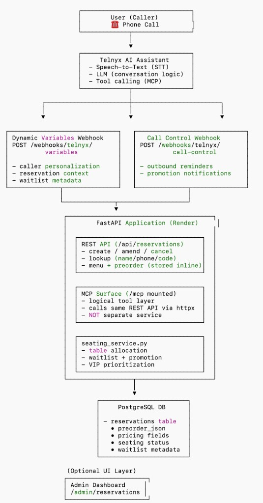
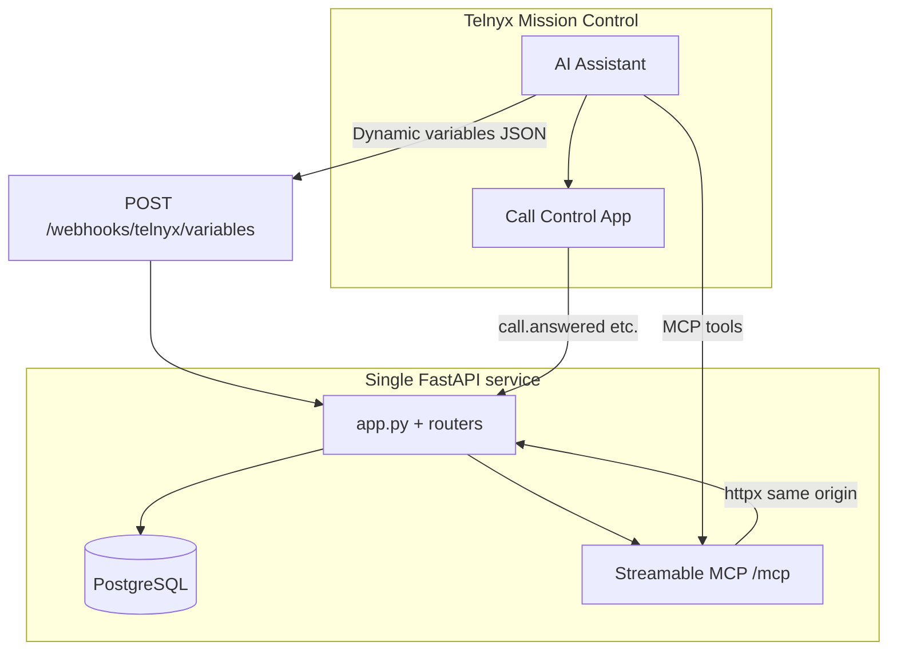

# Telnyx Voice AI — Hanok Table (Restaurant Reservations)

> **Hanok Table** is a **Korean-inspired demo restaurant** you can book by **phone** through a **Telnyx AI Assistant**. This repo is one deployable backend: **FastAPI**, **PostgreSQL**, **custom MCP tools**, **dynamic webhook variables**, and **Call Control** outbound reminders—with optional **table allocation and waitlist** logic.

[](https://developers.telnyx.com/)
[](https://modelcontextprotocol.io/)
[](https://fastapi.tiangolo.com/)
[](https://render.com/)
[](https://www.python.org/)
[](LICENSE)

**Repository:** [github.com/hjleepapa/8-telnyx](https://github.com/hjleepapa/8-telnyx)

---

## Architecture

System overview: **caller → Telnyx AI Assistant → webhooks + mounted MCP → FastAPI on Render → PostgreSQL**, with optional **admin** UI on the same origin. The diagram matches this repo: **`POST /webhooks/telnyx/variables`** and **`POST /webhooks/telnyx/call-control`**, **`/mcp/`** as an in-process tool surface over **`/api/reservations`**, and preorder **inline** on **`reservations`** (not a separate preorder table).



| Layer | Role |
|-------|------|
| **User (caller)** | Voice session into **Telnyx**; STT and LLM drive dialogue and **tool calling**. |
| **Telnyx AI Assistant** | Mission Control assistant: uses **MCP** for structured reservation/menu tools and merges **dynamic variables** into instructions each turn. |
| **Dynamic variables** | **`POST /webhooks/telnyx/variables`** — personalization and reservation context (normalized **caller ID**, upcoming booking, pre-order totals, **waitlist / seating** hints, concierge fields). |
| **MCP server (HTTP)** | **`/mcp/`** (when `HANOK_MCP_HTTP_MOUNT=1`) — tools are a thin async layer over **`/api/reservations/…`** (create, lookup, amend, cancel, menu, seating availability). See [`telnyx_restaurant/mcp_server/README.md`](telnyx_restaurant/mcp_server/README.md). |
| **Call Control** | **`POST /webhooks/telnyx/call-control`** — outbound **reminder** and TTS flows (`client_state` + optional DB lookups). |
| **FastAPI backend** | **`/api/reservations`** — REST for create / lookup / amend / **cancel**, menu + pre-order payloads. **[`seating_service.py`](telnyx_restaurant/seating_service.py)** — **table allocation**, **waitlist** caps (weighted by tables needed), **VIP / spend-based** queue ordering, and **promotion** when inventory opens. |
| **PostgreSQL** | **`reservations`**, **pre-order** fields, **`table_slot_inventory`** when allocation is enabled (capacity and waitlist-related behavior). |
| **Admin dashboard (optional)** | **`GET /admin/reservations`** — server-rendered list/detail when `DB_URI` and optional `ADMIN_DASHBOARD_TOKEN` are set. |

Other same-origin pages (not shown on the diagram) include **online booking**, **`/reservation-lab`**, and OpenAPI **`/docs`**.

---

## Telnyx challenge — core requirements

This project is structured around the four required pillars below. Each maps directly to what you configure in **Telnyx Mission Control** and what runs on **Render**.

### 1. AI assistant (required)

| Requirement | How this project satisfies it |
|-------------|-------------------------------|
| Build an assistant in the **Telnyx Portal** (Assistant Builder) | Configure your assistant against **Hanok Table**: book by phone, look up reservations, change party size or time, pre-order menu items, cancel, and (when enabled) understand **waitlisted vs table-assigned** bookings. |
| **Compelling use case** | Full **voice reservation flow** with **menu-backed pre-orders**, optional **table inventory / waitlist**, **VIP waitlist priority** by explicit flag or large pre-order total, and **outbound reminder calls** when a table is confirmed or when a waitlisted guest is promoted. |
| **Callable via phone number** | Point a **Telnyx number** at your assistant; the assistant uses MCP (and/or HTTP tools) against your deployed API. |
| **Real conversational interactions** | Tools support natural aliases (phones, names, confirmation codes, `HNK-…` codes); voice **dedup** reduces double-booking from repeated tool calls. |

**What you configure in Telnyx:** assistant instructions should tell the model to read **tool JSON** after creates (especially `seating_status`: **allocated** vs **waitlist**) and to use **dynamic variables** (below) when the portal merges them into prompts.

---

### 2. MCP server integration (required)

| Requirement | How this project satisfies it |
|-------------|-------------------------------|
| **Custom MCP server** the assistant can use | [`telnyx_restaurant/mcp_server/server.py`](telnyx_restaurant/mcp_server/server.py) implements a **FastMCP** server with tools backed by your **same** reservation REST API. |
| **Meaningful tools / resources** | **Menu** lookup, **create** reservation (with `preorder_items` / lines), **lookup** by name+phone, **fetch by code**, **amend** (time, party, pre-order, notes, contact), **status / cancel**, optional **seating availability** by date. |
| **Enhances the assistant** | The assistant does not need hard-coded menu prices or ad-hoc HTTP shaping for every tool—MCP exposes structured operations over **httpx** to `POST /api/reservations`, `GET /lookup`, `PATCH …/amend`, etc. |

**Deploy URL (HTTP transport):** on **Render**, set **`HANOK_MCP_HTTP_MOUNT=1`** and point Telnyx at **`https://<your-render-host>/mcp/`** (trailing slash recommended). Steps: [`telnyx_restaurant/mcp_server/README.md`](telnyx_restaurant/mcp_server/README.md).

---

### 3. Dynamic webhook variables (required)

| Requirement | How this project satisfies it |
|-------------|-------------------------------|
| **Implement dynamic webhook variables** | **`POST /webhooks/telnyx/variables`** returns JSON keyed for instruction templates (map keys in Telnyx to these fields). |
| **Personalize / fetch context** | Caller ANI is matched to **`guest_phone`** (normalized variants). Response includes guest name, **upcoming reservation** metadata, pre-order summary and **food totals**, **seating / waitlist** fields when table allocation is on, and **concierge** hints for high-value pre-orders. |
| **Show how data improves the flow** | Example: if `{{guest_is_high_value_preorder}}` is **yes**, instructions can use `{{concierge_service_hint}}` and `{{cancel_retention_offer}}` on cancel intent; if `{{reservation_seating_status}}` is **waitlist**, the assistant should **not** say a table is confirmed until **allocated**. |
| **Deployed API** | Variables resolve against **PostgreSQL**; set **`DB_URI`** on Render. Without a DB, behavior is limited (demo ANI suffixes still return synthetic profiles in code). |

**Webhook URL:** `POST https://<your-render-host>/webhooks/telnyx/variables`

**Canonical Telnyx Assistant instructions (single paste)** — Replace overlapping fragments in Mission Control with this one block. Map JSON keys from `POST …/variables` to the same `{{variable_names}}` used below.

```text
You are a restaurant booking assistant for phone callers, powered by Telnyx. This conversation is on {{telnyx_conversation_channel}} at {{telnyx_current_time}}. The agent target is {{telnyx_agent_target}} and the caller is {{telnyx_end_user_target}}.

Your job is to help callers book, change, or cancel reservations by voice, with natural back-and-forth about date, time, and party size. Always confirm out loud before finalizing or changing: date, time, party size, name, phone number, and location (if you have multiple). Use short follow-ups to resolve ambiguity (“this Friday” vs a calendar date, time ranges, flexible party size), and restate the outcome at the end.

Tone: concise and friendly. Usually 2–3 sentences and one follow-up question when something is missing. If the caller is lost or upset, you may use up to 4 short sentences.

— Backend: MCP only —
Reservation and menu operations MUST use the configured MCP server tools (Hanok Table). Do not use separate HTTP Action tools that call the same REST paths (create, lookup, amend, status)—that causes duplicate bookings, double PATCHs, and inconsistent pre-orders. If you see both MCP tools and HTTP tools, use only MCP. In Mission Control: disable or remove HTTP Action tools that duplicate create_reservation, get_reservation, update_reservation_details, set_reservation_status, list_menu / menu GET, and seating GET.

MCP tools return JSON text (typically http_status and data). Read the numeric id and confirmation_code from data after lookup or create.

Critical: Any update or cancel needs the real numeric reservation_id from get_reservation (or from create response). Never pass a placeholder like {{reservation_id}} into tools—always the actual id from the last tool response.

— Caller ID and lookup (dynamic webhook) —
Use these when POST …/webhooks/telnyx/variables is wired. Do not invent values.

• {{caller_phone_telnyx}} — raw ANI from payload
• {{caller_phone_normalized}} — E.164 for typical US numbers (use this as MCP guest_phone when possible)
• {{caller_line_reservation_count}} — how many candidate reservations match this line (same pool as API lookup)
• {{caller_line_single_booking}} — yes or no; yes = exactly one candidate row for this phone
• {{caller_line_has_multiple_bookings}} — yes or no
• {{caller_line_booking_guest_names_hint}} — short list: Name (HNK-…); …
• {{guest_personalized_greeting_suggestion}} — speakable greeting when a single booking matches
• {{guest_lookup_name_for_tools}} — full guest_name on file (optional; for disambiguation or rare tools—not required for phone-only lookup)
• {{guest_lookup_identification_hint}} — follow this narrative when unsure

Phone behavior:
- When {{caller_phone_normalized}} is non-empty, do NOT ask the caller to repeat their phone on every turn. Prefer {{caller_phone_normalized}} (or {{telnyx_end_user_target}} normalized) as MCP guest_phone.
- When {{caller_line_single_booking}} is yes: open with {{guest_personalized_greeting_suggestion}} (or {{guest_display_name}})—do NOT ask for their name before the first lookup. Call get_reservation with ONLY guest_phone (= {{caller_phone_normalized}}); omit guest_name so the tool uses phone-only lookup.
- When {{caller_line_has_multiple_bookings}} is yes: ask which name the booking is under, then call get_reservation with guest_phone AND guest_name. You may use {{caller_line_booking_guest_names_hint}} if they are unsure.

— High-value pre-orders —
If {{guest_is_high_value_preorder}} is yes, follow {{concierge_service_hint}}. Acknowledge {{reservation_food_total_display}} and {{reservation_preorder_summary}}.
If the caller wants to cancel or change time and {{guest_is_high_value_preorder}} is yes, proactively offer a small goodwill gesture (e.g. complimentary items on visit) and prioritize rebooking per your policy.

— Language —
If {{locale_hint}} is ko-KR, carry the conversation in Korean (menus, times, confirmations). Otherwise use English (en-US) unless the caller switches language.

— After create_reservation / tool JSON (seating) —
Read seating_status (ReservationRead):
• waitlist — No table at that time; they are on the waitlist; they still have a confirmation code. Do NOT say a table is reserved.
• allocated — Table assigned; you may mention table sizes if present.
• not_applicable — Table allocation may be off; do not promise table logic unless the product uses allocation.

Reservation status = confirmed only means the booking is stored—not that a table exists when seating_status is waitlist.

Dynamic webhook: if {{reservation_seating_status}} is waitlist, they do not have a table yet; use {{waitlist_fairness_hint}} for VIP/fairness. When the restaurant is full and you must not offer waitlist, use waitlist_if_full false on create; otherwise the API may still return 200 with seating_status waitlist.

— Waitlist position and EWT (only when variables apply) —
If {{reservation_seating_status}} is exactly "waitlist" AND {{guest_waitlist_position}} is a positive integer string (not "0", not "n/a"):
• Say they are {{guest_waitlist_position_ordinal_en}} in line when non-empty; otherwise "number" {{guest_waitlist_position}}.
• Mention {{guest_waitlist_queue_size}} parties on the waitlist for that window.
• Estimated wait ≈ {{guest_waitlist_estimated_wait_minutes}} minutes (not exact). With defaults, about 15 minutes per position (1st ≈ 15, 2nd ≈ 30, …).
• You may use {{guest_waitlist_wait_time_hint}} verbatim or paraphrase.
• Cap: {{guest_waitlist_max_parties_per_slot}} weighted capacity units (larger parties needing multiple tables count as more than one unit). If create returns 409 waitlist full, use {{guest_waitlist_alternate_time_hint}}; offer ~2 hours earlier or later, then retry availability/booking.
• Multi-table / feasibility: if {{guest_waitlist_can_seat_after_ahead}} is "no", do not promise a table at this time; follow {{guest_waitlist_seating_capacity_hint}}; suggest ~2 hours earlier/later or search_seating_availability if exposed. If {{guest_waitlist_ahead_queue_feasible}} is "no", the queue is especially tight. Reference {{guest_waitlist_tables_required}} when explaining large parties.

If {{reservation_seating_status}} is "allocated", do not give waitlist position or EWT from these fields.
If {{guest_waitlist_position}} is "0" or {{reservation_seating_status}} is "not_applicable", do not invent waitlist numbers or ETAs.
If {{guest_waitlist_position}} is "n/a", waitlists are not in use on this deployment.
If {{guest_waitlist_priority}} is vip or {{waitlist_fairness_hint}} explains priority, use that when they ask why someone is ahead.

Never contradict {{reservation_seating_status}}. If waitlisted, do not say a table is confirmed until allocated.

— MCP tools (Hanok Table) —
get_reservation — guest_phone (required, use {{caller_phone_normalized}}). guest_name (optional). If guest_name omitted and only one booking exists on the line, tool uses phone-only lookup. If multiple bookings share the line, pass guest_name after asking. Always before amend, status change, or cancel when you need id and confirmation code.

list_menu_items — Call before building or changing a pre-order.

search_seating_availability — Optional; argument date YYYY-MM-DD (UTC calendar day). Only if table allocation is enabled; if 404/unavailable, skip or proceed with caller’s time.

create_reservation — guest_name, guest_phone, party_size, starts_at (ISO-8601), optional preorder_lines_json, special_requests, source_channel (use voice). Flow: optional seating date check → list_menu_items if pre-order → create_reservation. Confirm code, time, party aloud.

update_reservation_details — reservation_id (integer) plus fields to change. Not for raw lifecycle alone.

set_reservation_status — reservation_id and status (pending, confirmed, seated, completed, cancelled).

cancel_reservation — reservation_id; prefer when intent is cancel only.

hangup — If exposed, end the call when the caller is done.

— Flows —
Book: Collect date, time, party, name, phone, optional pre-order and notes → optional search_seating_availability → list_menu_items if pre-order → create_reservation. Confirm aloud.
Change: get_reservation (phone-only or phone+name per rules above) → confirm delta → update_reservation_details with reservation_id from lookup.
Cancel: Confirm booking → get_reservation if needed → cancel_reservation or set_reservation_status cancelled. Summarize aloud.
Allergies/notes: special_requests via update_reservation_details.

— Webhook personalization (do not invent) —
Typical keys: {{guest_display_name}}, {{vip_tier}}, {{preferred_venue_slug}}, {{default_party_size}}, {{locale_hint}}, {{has_upcoming_reservation}}, {{next_reservation_at}}, {{next_reservation_code}}, {{reservation_preorder_summary}}, plus seating/waitlist keys above.
If has_upcoming_reservation is true, briefly acknowledge and ask if they are calling about that booking.

Closing: After success, summarize and ask if anything else. If done, say goodbye and hangup if available.
```

**Useful keys (non-exhaustive):** map JSON fields to Telnyx instruction variables and reference them as `{{guest_display_name}}`, `{{next_reservation_code}}`, `{{next_reservation_at}}`, `{{reservation_preorder_summary}}`, `{{reservation_food_total_cents}}`, `{{guest_is_high_value_preorder}}`, `{{concierge_service_hint}}`, `{{cancel_retention_offer}}`, `{{reservation_seating_status}}`, `{{guest_waitlist_priority}}`, `{{waitlist_fairness_hint}}`, `{{guest_waitlist_position}}`, `{{guest_waitlist_queue_size}}`, `{{guest_waitlist_estimated_wait_minutes}}`, `{{guest_waitlist_position_ordinal_en}}`, `{{guest_waitlist_wait_time_hint}}`, `{{guest_waitlist_tables_required}}`, `{{guest_waitlist_can_seat_after_ahead}}` (`yes` / `no`), `{{guest_waitlist_ahead_queue_feasible}}` (`yes` / `no`), `{{guest_waitlist_seating_capacity_hint}}`, `{{guest_waitlist_max_parties_per_slot}}`, `{{guest_waitlist_alternate_time_hint}}`, `{{caller_line_single_booking}}`, `{{guest_personalized_greeting_suggestion}}`, `{{guest_lookup_name_for_tools}}` (plus `{{preferred_locale}}` / `{{locale_hint}}` — see **Future improvements** below). Estimated wait is **position × `HANOK_WAITLIST_MINUTES_PER_POSITION`** (default **15** minutes). **`guest_waitlist_can_seat_after_ahead`** is **`no`** when, after simulating parties ahead in queue order, **current table counts** may not fit this party (e.g. **large party needing two or more tables** while only one compatible table may remain). **`guest_waitlist_tables_required`** is how many tables the plan uses for this party at full template capacity (speech only). **`HANOK_WAITLIST_MAX_PER_SLOT`** (default **5**) caps the **sum** of those units across waitlisted parties for the same slot; multi-table parties consume more than one unit; further waitlist joins return **409**.

**Caller ID / shared phone (demo):** `{{caller_phone_normalized}}` and `{{caller_phone_telnyx}}` come from the PSTN layer—bind them to MCP **`guest_phone`**. Waitlist, seating_status, and phone-only vs named lookup are all in the **canonical paste block above**; delete older duplicate fragments from Mission Control so the model doesn’t see conflicting rules.

**Related:** **`POST /webhooks/telnyx/call-control`** handles **Call Control** for **outbound reminder** TTS (`client_state` + optional DB fallback).

**Troubleshooting table allocation:** Capacity is stored per `(slot_start, table_size)` in the `table_slot_inventory` table. If you change **`HANOK_TABLE_INVENTORY_JSON`** or see **only the first reservation get a table** while the rest waitlist, older rows may still hold **`available_count = 0`** for one of the time buckets touched by your stay length (the allocator uses the **minimum** count across all buckets). Clear inventory and let the app recreate rows on the next bookings:

- **Render shell / Postgres:** `DELETE FROM table_slot_inventory;` or run **`python scripts/reset_table_inventory.py`** (requires **`DB_URI`** / **`DATABASE_URL`**).
- Turn on **`HANOK_RESERVATION_VERBOSE_LOG=1`** temporarily; failed allocations log **`eff`** / **`maps`** from `try_allocate_and_consume`.

---

### 4. Public deployment (required)

| Requirement | How this project satisfies it |
|-------------|-------------------------------|
| **Deploy publicly** | **Render.com** web service + **PostgreSQL** (see checklist below). The app entrypoint is **`uvicorn telnyx_restaurant.app:app`** (root **`Procfile`**). |
| **Working URLs / numbers for reviewers** | **You** publish your live **`https://…`** origin and the **Telnyx phone number** attached to the assistant. This README documents paths; it does not hard-code a challenge-specific number. |
| **Clear documentation** | **This file** + [`telnyx_restaurant/mcp_server/README.md`](telnyx_restaurant/mcp_server/README.md) + [`telnyx_restaurant/.env.example`](telnyx_restaurant/.env.example). |

**Minimum public checklist**

1. **Web:** `https://<host>/health` returns **200**.
2. **DB:** `DB_URI` / `DATABASE_URL` set; migrations applied via app startup / `db.py` guards.
3. **Optional MCP:** `HANOK_MCP_HTTP_MOUNT=1`, **`HANOK_PUBLIC_BASE_URL=https://<host>`** (helps Telnyx HTTP client and reminder `webhook_url` override).
4. **Telnyx:** Assistant **MCP** → `https://<host>/mcp/`; **Dynamic variables** + **Call Control** → `…/variables` and `…/call-control`.
5. **Outbound reminders (demo):** `TELNYX_API_KEY`, `TELNYX_CONNECTION_ID`, `TELNYX_FROM_NUMBER`.

**Render (example):**

- **Start:** `uvicorn telnyx_restaurant.app:app --host 0.0.0.0 --port $PORT` (or use root **`Procfile`**).
- If `/` 404s but `/health` works, confirm **`static/index.html`** ships and **Root Directory** is repo root.

---

## Architecture (high level)



| Layer | Role |
|-------|------|
| **`routers/reservations.py`** | `/api/reservations` — create, list, lookup, PATCH **amend**, status/cancel, voice create dedup, **naive `starts_at` → wall-clock TZ → UTC**, **re-seat on amend** when table allocation is enabled. |
| **`routers/webhook.py`** | Dynamic **variables** + **call-control** for reminders. |
| **`routers/admin.py`** | **`GET /admin/reservations`** — calendar (day / week / month; view mode persisted in **localStorage**). |
| **`seating_service.py`** | Optional inventory, **waitlist promotion** (VIP by flag or pre-order total), **reminder** when a waitlisted guest gets a table. |
| **`mcp_server/server.py`** | MCP tools → same REST API. |

**Time semantics:** `starts_at` is stored in **UTC**. Values **with** an explicit offset keep their meaning. **Naive** ISO strings are interpreted as **restaurant wall time** (`HANOK_RESERVATION_WALL_TIMEZONE`, default aligned with `HANOK_ADMIN_DISPLAY_TIMEZONE`, typically `America/Los_Angeles`).

**Data:** Synthetic demo / reviewer use — not production PII.

---

## REST API (prefix `/api/reservations`)

| Method | Path | Purpose |
|--------|------|---------|
| GET | `/menu/items` | Menu for tools and web. |
| GET | `/seating/availability` | If allocation enabled: `?date=YYYY-MM-DD`. |
| GET | `` | List reservations (JSON). |
| POST | `` | Create (`waitlist_if_full`, `guest_priority`, preorder, `source_channel`, etc.). |
| GET | `/lookup` | **`guest_name` + phone** (primary). |
| GET | `/by-code/{code}` | By **HNK-…** |
| PATCH | `/amend`, `/{id}/amend`, `/by-code/...` | Partial updates; **`X-Hanok-Reservation-Changed`** header reflects real DB writes. |

Full route table and PATCH semantics are in code comments and earlier sections; see also **OpenAPI** at **`/docs`** on your Render URL.

---

## Static site & admin

| Route | Description |
|-------|-------------|
| `/` | Landing + widget hookup points. |
| `/reserve-online.html` | Web booking + pre-order. |
| `/reservation/status` | Guest lookup by confirmation code. |
| `/admin/reservations` | Staff calendar (**`?token=`** if `ADMIN_DASHBOARD_TOKEN`). |
| `/reservation-lab` | Optional API lab (`HANOK_RESERVATION_LAB=1`): create, lookup, amend, cancel (PATCH status), and hard delete (`DELETE /api/reservations/{id}` — lab-only, returns 404 when the flag is off). |
| `/health` | Liveness. |

---

## Environment variables

See **[`telnyx_restaurant/.env.example`](telnyx_restaurant/.env.example)** for the full list. Highlights:

| Variable | Role |
|----------|------|
| **`DB_URI`** / **`DATABASE_URL`** | Postgres (Render-friendly SSL hinting in code). |
| **`HANOK_PUBLIC_BASE_URL`** | Public origin (reminder `webhook_url`, MCP). |
| **`HANOK_MCP_HTTP_MOUNT`**, path / DNS rebinding | MCP on same process. |
| **`TELNYX_*`** | Outbound reminders + Call Control. |
| **`HANOK_TABLE_ALLOCATION_ENABLED`**, **`HANOK_TABLE_INVENTORY_JSON`**, **`HANOK_VIP_PREORDER_CENTS`**, **`HANOK_PREMIUM_PREORDER_CENTS`** | Seating + waitlist + premium / VIP tiers. |

---

## Repository structure

```
8.telnyx/
├── README.md
├── Procfile
├── requirements.txt
└── telnyx_restaurant/
    ├── app.py
    ├── routers/{admin,reservations,webhook}.py
    ├── mcp_server/{server.py,README.md}
    ├── static/, templates/
    └── tests/
```

**API reference on Render:** `https://<your-render-host>/docs` (OpenAPI).

---

## Security & license

- Demo data only; do not commit real **`.env`** secrets.
- **MIT** — [LICENSE](LICENSE).

---

## Future improvements: locale & Korean (`locale_hint`)

The API and web UI already support **`preferred_locale`** (`en` / `ko`) on reservations. Dynamic variables can expose **`locale_hint`** (`en-US` / `ko-KR`) so instructions can say “speak Korean when `locale_hint` is ko-KR.”

**Current limitation:** In testing, **Korean speech-to-text (STT) quality in Telnyx** has been **unreliable** compared to English. Until STT for Korean improves, this README treats **Korean voice** as a **future integration path** rather than the primary demo story. The **English** assistant + **same backend** (MCP, variables, waitlist, reminders) remains the center of the challenge deliverable. You can still collect `preferred_locale=ko` from **web** bookings and use it for **dynamic variables** or post-call flows.

---

**Deploy details & MCP copy-paste:** [`telnyx_restaurant/mcp_server/README.md`](telnyx_restaurant/mcp_server/README.md)
