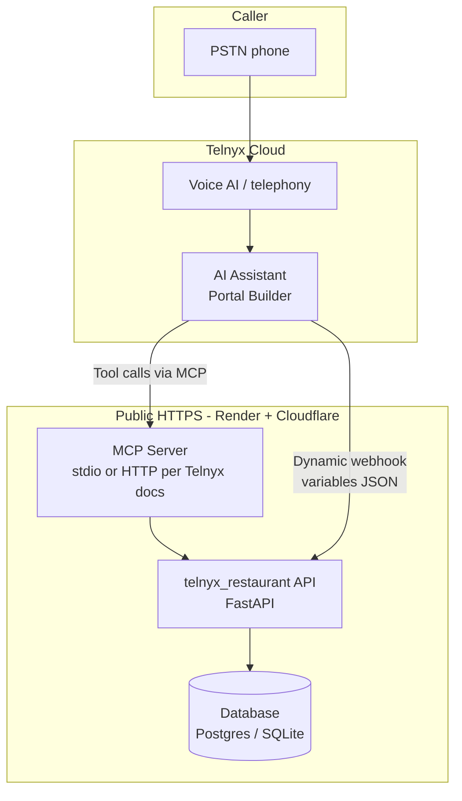
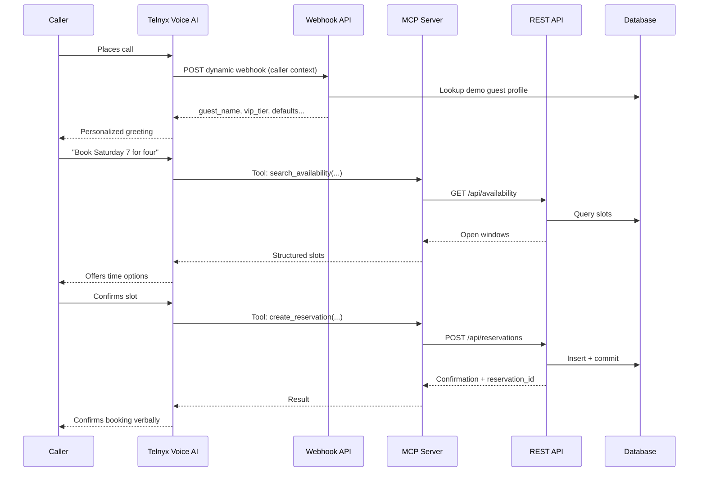

# Telnyx Voice AI — Restaurant Reservation Assistant

> **Telnyx coding challenge:** Voice AI assistant for restaurant reservations, powered by the **Telnyx AI Assistant** (Portal), **dynamic webhook variables**, a **custom MCP server**, and a **publicly deployed** backend on **Render** behind **Cloudflare**.

[](https://developers.telnyx.com/)
[](https://modelcontextprotocol.io/)
[](https://fastapi.tiangolo.com/)
[](https://render.com/)
[](https://www.python.org/)
[](LICENSE)

---

## Overview

This repository implements a **restaurant reservation** experience over the phone: callers check availability, book or modify a table, confirm party size and time, and hear personalized greetings using **context resolved before the conversation** (dynamic webhooks). The AI assistant uses **MCP tools** that delegate to the same backend API that stores reservation rules and demo data.

**Target users:** Guests calling a fictional demo restaurant (synthetic data only — no real guest PII).

### Challenge requirements mapping

| Requirement | How it is addressed |
|-------------|---------------------|
| **Telnyx AI Assistant** | Built in [Telnyx Portal](https://portal.telnyx.com/) Assistant Builder; assistant attached to a **Telnyx phone number**. |
| **Callable via phone** | Inbound PSTN → Telnyx Voice AI → assistant. |
| **Real conversational UX** | Multi-turn prompts: date/time, party size, confirmation, cancel/change flows; one clarification at a time for voice. |
| **Custom MCP server** | Tools: availability lookup, create/update/cancel reservation, optional “today’s specials” resource (see [MCP tools](#mcp-tools)). |
| **Dynamic webhook variables** | HTTPS webhook on dedicated host (e.g. `telnyx.convonetai.com`) returns variables personalized from **caller ID** / demo profile (see [Webhook variables](#dynamic-webhook-variables)). |
| **Public deployment** | Render **Web Service** + custom subdomain on **Cloudflare** (`convonetai.com` zone). |

---

## Key features

- **Voice-first reservations** — Natural language for date/time; backend normalizes to a timezone-safe slot model.
- **Dynamic personalization** — Greeting and defaults (e.g. preferred location, VIP tier, language hint) from webhook payload mapped in the assistant instructions.
- **MCP-extended agent** — Structured tools with validation; single source of truth in the REST API backing both webhook lookups and tool executions.
- **Focused codebase** — Python service under [`telnyx_restaurant/`](telnyx_restaurant/) only; no legacy multi-service stack in this repo.

---

## High-level architecture

Telnyx hosts STT/LLM/TTS and dials your **webhook** and **MCP** endpoints over the public internet. Your backend owns reservation data (PostgreSQL or SQLite for demo) and enforces slot consistency.



### Component responsibilities

| Component | Responsibility |
|-----------|----------------|
| **Telnyx AI Assistant** | Call flow, speech, LLM, tool invocation, instruction templates with `{{ variable }}` placeholders. |
| **Webhook handler** (`telnyx_restaurant`) | Map **Telnyx-provided request** (caller number, metadata) → JSON variables for personalization. |
| **REST API** | Authoritative reservation CRUD, availability search, idempotency / conflict handling for double-booking. |
| **MCP server** | Expose tools/resources; call REST API; return structured results for the model to summarize. |
| **Database** | Stores venues (optional), tables or capacity model, reservations, guest demo profiles. |
| **Cloudflare DNS** | `telnyx.convonetai.com` (example) → Render service. |
| **Render** | Runs FastAPI (+ optional separate MCP process or worker as per deployment design). |

---

## Call flow (sequence)

Typical **book a table** path: webhook runs first; then conversation; model invokes MCP tools; API updates DB.



---

## Dynamic webhook variables

Configure the Telnyx assistant to fetch variables from your deployed webhook URL. Map response JSON keys to template variables in the Portal (exact mechanism follows [Telnyx AI Assistants](https://developers.telnyx.com/docs/v2/ai/ai-assistants/) documentation).

**Example variables** (illustrative — names must match your Portal mapping):

| Variable | Source | Purpose |
|----------|--------|---------|
| `guest_display_name` | Demo profile keyed by ANI | Natural greeting |
| `vip_tier` | Demo CRM / seed table | Tone, priority |
| `preferred_venue_slug` | Profile default | Skip “which location?” when obvious |
| `default_party_size` | Past visits (demo) | Suggested party size |
| `locale_hint` | Profile | Optional language tuning |
| `has_upcoming_reservation` | DB boolean | Offer “modify existing” branch |

**Reference implementation:** [`telnyx_restaurant/routers/webhook.py`](telnyx_restaurant/routers/webhook.py) returns a JSON payload your assistant consumes.

---

## MCP tools

Expose **3–5 focused tools** (adjust names to match Portal configuration):

| Tool | Description |
|------|-------------|
| `search_availability` | Inputs: date, rough time, party size, venue. Returns candidate slots. |
| `create_reservation` | Creates hold/booking; returns confirmation code. |
| `get_reservation` | Lookup by code or phone + date. |
| `modify_reservation` | Change time/party size within rules. |
| `cancel_reservation` | Cancels per policy; returns status. |

Optional **MCP resource:** `restaurant://policy/cancellations.md` for cancellation windows (demo text).

Implementation lives in [`telnyx_restaurant/mcp_server/`](telnyx_restaurant/mcp_server/) (see package README).

---

## Technology stack

| Layer | Technology |
|-------|------------|
| Voice + AI runtime | **Telnyx** Voice AI, Assistant Builder |
| Protocol | **MCP** (Model Context Protocol) per Telnyx integration |
| Backend | **Python 3.11+**, **FastAPI** |
| Validation | **Pydantic** v2 |
| Data | **PostgreSQL** (Render) or **SQLite** for local demo |
| Hosting | **Render** Web Service |
| DNS / TLS edge | **Cloudflare** (`convonetai.com` zone) → Render custom hostname |

---

## Repository structure

```
8.telnyx/
├── README.md
├── LICENSE
├── Procfile                  # Render: uvicorn telnyx_restaurant.app:app
├── requirements.txt          # Delegates to telnyx_restaurant/requirements.txt
└── telnyx_restaurant/
    ├── README.md
    ├── requirements.txt
    ├── .env.example
    ├── app.py
    ├── static/
    │   └── index.html        # Hanok Table (Korean menu) landing + Telnyx AI widget
    ├── routers/
    │   └── webhook.py
    └── mcp_server/
        └── README.md
```

---

## Deployment (Option B — recommended)

1. **Render:** Create a **Web Service** from this repo; use repository **root** so imports resolve. **Start command** (or use included `Procfile`):  
   `uvicorn telnyx_restaurant.app:app --host 0.0.0.0 --port $PORT`
2. **Custom domain:** In Render, add `telnyx.convonetai.com` (or your chosen subdomain).
3. **Cloudflare:** `CNAME` that hostname to the target Render provides; proxy on/off per Telnyx/MCP requirements (long-lived streams may need DNS-only — confirm with Telnyx).
4. **Telnyx Portal:** Point **dynamic webhook** URL and **MCP** URL at your HTTPS endpoints; assign **phone number**.

**Render checklist (fixes `{"detail":"Not Found"}` on `/`):**

- **Root Directory:** leave **empty** (repository root), not `telnyx_restaurant`, so the start command `uvicorn telnyx_restaurant.app:app` can import the package.
- **Build / deploy:** trigger a fresh deploy after pushing; `/health` can work on an older revision while `/` was added later.
- **URLs:** home is [https://telnyx.convonetai.com/](https://telnyx.convonetai.com/) (or your Render URL); alternate [https://telnyx.convonetai.com/index.html](https://telnyx.convonetai.com/index.html). If `index.html` is missing on disk, the app now returns an HTML error page explaining the path instead of a generic JSON 404.

Document in your submission:

- **Public webhook URL** (exact path)
- **MCP connection** URL or command (per Telnyx docs)
- **Provisioned Telnyx DID** reviewers can dial

---

## Local development

Run from the **repository root** so `telnyx_restaurant` imports resolve.

```bash
git clone https://github.com/hjleepapa/8-telnyx.git
cd 8-telnyx

python -m venv .venv
source .venv/bin/activate
pip install -r requirements.txt
cp telnyx_restaurant/.env.example telnyx_restaurant/.env
uvicorn telnyx_restaurant.app:app --reload --host 0.0.0.0 --port 8080
```

- **Restaurant site + Telnyx web widget:** open `http://localhost:8080/` — Hanok Table (Korean cuisine) with **EN / 한국어** toggle (choice saved in `localStorage` as `hanok-lang`) and the Telnyx `<telnyx-ai-agent>` web component (script: `unpkg.com/@telnyx/ai-agent-widget@next`).
- **Health:** `GET http://localhost:8080/health`
- **Webhook (demo):** `POST http://localhost:8080/webhooks/telnyx/variables` with JSON body such as `{"caller_number": "+15551234567"}`

---

## Demo script (8–10 minutes)

1. Dial the Telnyx number; note personalized greeting driven by webhook variables.
2. Book a table: date → time → party size → confirmation.
3. Call again (or same call): modify or cancel; show tool + API behavior.
4. Show failure path: no availability → assistant offers alternatives.

---

## Documentation

| Document | Description |
|----------|-------------|
| **This README** | Architecture, flows, deployment |
| [`telnyx_restaurant/README.md`](telnyx_restaurant/README.md) | Runbook for the API + MCP |

---

## Security notes

- Use **synthetic** restaurant and guest data for demos.
- Authenticate webhook requests if Telnyx provides signatures or shared secrets; store secrets in Render env vars.
- Rate-limit and validate tool inputs server-side; never trust the model for authorization.

---

## License

MIT License — see [LICENSE](LICENSE).

---

## Acknowledgments

- [Telnyx](https://www.telnyx.com/) — Voice AI platform and assistant builder  
- [Model Context Protocol](https://modelcontextprotocol.io/) — Tool/resource standard  
- **FastAPI**, **Pydantic**, **uvicorn**  

**Repository:** [github.com/hjleepapa/8-telnyx](https://github.com/hjleepapa/8-telnyx)
