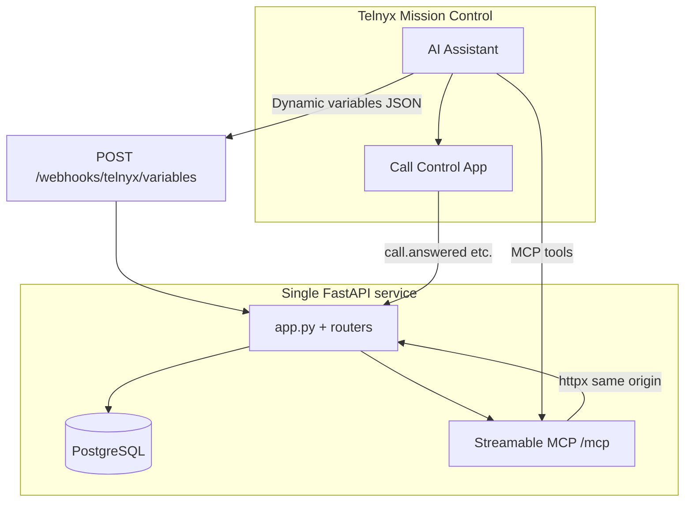

# Telnyx Voice AI — Hanok Table (Restaurant Reservations)

> **Hanok Table** is a **Korean-inspired demo restaurant** you can book by **phone** through a **Telnyx AI Assistant**. This repo is one deployable backend: **FastAPI**, **PostgreSQL**, **custom MCP tools**, **dynamic webhook variables**, and **Call Control** outbound reminders—with optional **table allocation and waitlist** logic.

[](https://developers.telnyx.com/)
[](https://modelcontextprotocol.io/)
[](https://fastapi.tiangolo.com/)
[](https://render.com/)
[](https://www.python.org/)
[](LICENSE)

**Repository:** [github.com/hjleepapa/8-telnyx](https://github.com/hjleepapa/8-telnyx)

---

## Telnyx challenge — core requirements

This project is structured around the four required pillars below. Each maps directly to what you configure in **Telnyx Mission Control** and what runs on your **public host**.

### 1. AI assistant (required)

| Requirement | How this project satisfies it |
|-------------|-------------------------------|
| Build an assistant in the **Telnyx Portal** (Assistant Builder) | Configure your assistant against **Hanok Table**: book by phone, look up reservations, change party size or time, pre-order menu items, cancel, and (when enabled) understand **waitlisted vs table-assigned** bookings. |
| **Compelling use case** | Full **voice reservation flow** with **menu-backed pre-orders**, optional **table inventory / waitlist**, **VIP waitlist priority** by explicit flag or large pre-order total, and **outbound reminder calls** when a table is confirmed or when a waitlisted guest is promoted. |
| **Callable via phone number** | Point a **Telnyx number** at your assistant; the assistant uses MCP (and/or HTTP tools) against your deployed API. |
| **Real conversational interactions** | Tools support natural aliases (phones, names, confirmation codes, `HNK-…` codes); voice **dedup** reduces double-booking from repeated tool calls. |

**What you configure in Telnyx:** assistant instructions should tell the model to read **tool JSON** after creates (especially `seating_status`: **allocated** vs **waitlist**) and to use **dynamic variables** (below) when the portal merges them into prompts.

---

### 2. MCP server integration (required)

| Requirement | How this project satisfies it |
|-------------|-------------------------------|
| **Custom MCP server** the assistant can use | [`telnyx_restaurant/mcp_server/server.py`](telnyx_restaurant/mcp_server/server.py) implements a **FastMCP** server with tools backed by your **same** reservation REST API. |
| **Meaningful tools / resources** | **Menu** lookup, **create** reservation (with `preorder_items` / lines), **lookup** by name+phone, **fetch by code**, **amend** (time, party, pre-order, notes, contact), **status / cancel**, optional **seating availability** by date. |
| **Enhances the assistant** | The assistant does not need hard-coded menu prices or ad-hoc HTTP shaping for every tool—MCP exposes structured operations over **httpx** to `POST /api/reservations`, `GET /lookup`, `PATCH …/amend`, etc. |

**Deploy URL (HTTP transport):** enable **`HANOK_MCP_HTTP_MOUNT=1`** and point Telnyx at **`https://<your-host>/mcp/`** (trailing slash recommended). Deep copy-paste steps: [`telnyx_restaurant/mcp_server/README.md`](telnyx_restaurant/mcp_server/README.md).

**Local / stdio:** `PYTHONPATH=. python -m telnyx_restaurant.mcp_server`

---

### 3. Dynamic webhook variables (required)

| Requirement | How this project satisfies it |
|-------------|-------------------------------|
| **Implement dynamic webhook variables** | **`POST /webhooks/telnyx/variables`** returns JSON keyed for instruction templates (map keys in Telnyx to these fields). |
| **Personalize / fetch context** | Caller ANI is matched to **`guest_phone`** (normalized variants). Response includes guest name, **upcoming reservation** metadata, pre-order summary and **food totals**, **seating / waitlist** fields when table allocation is on, and **concierge** hints for high-value pre-orders. |
| **Show how data improves the flow** | Example: if `guest_is_high_value_preorder` is **yes**, instructions can use `concierge_service_hint` and `cancel_retention_offer` on cancel intent; if `reservation_seating_status` is **waitlist**, the assistant should **not** say a table is confirmed until **allocated**. |
| **Deployed API** | Variables resolve against **PostgreSQL**; set **`DB_URI`** on your host. Without a DB, behavior is limited (demo ANI suffixes still return synthetic profiles in code). |

**Webhook URL:** `POST https://<your-public-host>/webhooks/telnyx/variables`

**Useful keys (non-exhaustive):** `guest_display_name`, `next_reservation_code`, `next_reservation_at`, `reservation_preorder_summary`, `reservation_food_total_cents`, `guest_is_high_value_preorder`, `concierge_service_hint`, `cancel_retention_offer`, `reservation_seating_status`, `guest_waitlist_priority`, `waitlist_fairness_hint` (plus `preferred_locale` / `locale_hint` — see **Future improvements** below).

**Related:** **`POST /webhooks/telnyx/call-control`** handles **Call Control** for **outbound reminder** TTS (`client_state` + optional DB fallback).

---

### 4. Public deployment (required)

| Requirement | How this project satisfies it |
|-------------|-------------------------------|
| **Deploy publicly** | Example: **Render** web service + **PostgreSQL** (see checklist below). Other hosts work if they run **`uvicorn telnyx_restaurant.app:app`** with **`DB_URI`**. |
| **Working URLs / numbers for reviewers** | **You** publish your live **`https://…`** origin and the **Telnyx phone number** attached to the assistant. This README documents paths; it does not hard-code a challenge-specific number. |
| **Clear documentation** | **This file** + [`telnyx_restaurant/mcp_server/README.md`](telnyx_restaurant/mcp_server/README.md) + [`telnyx_restaurant/.env.example`](telnyx_restaurant/.env.example). |

**Minimum public checklist**

1. **Web:** `https://<host>/health` returns **200**.
2. **DB:** `DB_URI` / `DATABASE_URL` set; migrations applied via app startup / `db.py` guards.
3. **Optional MCP:** `HANOK_MCP_HTTP_MOUNT=1`, **`HANOK_PUBLIC_BASE_URL=https://<host>`** (helps Telnyx HTTP client and reminder `webhook_url` override).
4. **Telnyx:** Assistant **MCP** → `https://<host>/mcp/`; **Dynamic variables** + **Call Control** → `…/variables` and `…/call-control`.
5. **Outbound reminders (demo):** `TELNYX_API_KEY`, `TELNYX_CONNECTION_ID`, `TELNYX_FROM_NUMBER`.

**Render (example):**

- **Start:** `uvicorn telnyx_restaurant.app:app --host 0.0.0.0 --port $PORT` (or use root **`Procfile`**).
- If `/` 404s but `/health` works, confirm **`static/index.html`** ships and **Root Directory** is repo root.

---

## Architecture (high level)



| Layer | Role |
|-------|------|
| **`routers/reservations.py`** | `/api/reservations` — create, list, lookup, PATCH **amend**, status/cancel, voice create dedup, **naive `starts_at` → wall-clock TZ → UTC**, **re-seat on amend** when table allocation is enabled. |
| **`routers/webhook.py`** | Dynamic **variables** + **call-control** for reminders. |
| **`routers/admin.py`** | **`GET /admin/reservations`** — calendar (day / week / month; view mode persisted in **localStorage**). |
| **`seating_service.py`** | Optional inventory, **waitlist promotion** (VIP by flag or pre-order total), **reminder** when a waitlisted guest gets a table. |
| **`mcp_server/server.py`** | MCP tools → same REST API. |

**Time semantics:** `starts_at` is stored in **UTC**. Values **with** an explicit offset keep their meaning. **Naive** ISO strings are interpreted as **restaurant wall time** (`HANOK_RESERVATION_WALL_TIMEZONE`, default aligned with `HANOK_ADMIN_DISPLAY_TIMEZONE`, typically `America/Los_Angeles`).

**Data:** Synthetic demo / reviewer use — not production PII.

---

## REST API (prefix `/api/reservations`)

| Method | Path | Purpose |
|--------|------|---------|
| GET | `/menu/items` | Menu for tools and web. |
| GET | `/seating/availability` | If allocation enabled: `?date=YYYY-MM-DD`. |
| GET | `` | List reservations (JSON). |
| POST | `` | Create (`waitlist_if_full`, `guest_priority`, preorder, `source_channel`, etc.). |
| GET | `/lookup` | **`guest_name` + phone** (primary). |
| GET | `/by-code/{code}` | By **HNK-…** |
| PATCH | `/amend`, `/{id}/amend`, `/by-code/...` | Partial updates; **`X-Hanok-Reservation-Changed`** header reflects real DB writes. |

Full route table and PATCH semantics are in code comments and earlier sections; see also **OpenAPI** at **`/docs`** on your host.

---

## Static site & admin

| Route | Description |
|-------|-------------|
| `/` | Landing + widget hookup points. |
| `/reserve-online.html` | Web booking + pre-order. |
| `/reservation/status` | Guest lookup by confirmation code. |
| `/admin/reservations` | Staff calendar (**`?token=`** if `ADMIN_DASHBOARD_TOKEN`). |
| `/reservation-lab` | Optional API lab (`HANOK_RESERVATION_LAB=1`). |
| `/health` | Liveness. |

---

## Environment variables

See **[`telnyx_restaurant/.env.example`](telnyx_restaurant/.env.example)** for the full list. Highlights:

| Variable | Role |
|----------|------|
| **`DB_URI`** / **`DATABASE_URL`** | Postgres (Render-friendly SSL hinting in code). |
| **`HANOK_PUBLIC_BASE_URL`** | Public origin (reminder `webhook_url`, MCP). |
| **`HANOK_MCP_HTTP_MOUNT`**, path / DNS rebinding | MCP on same process. |
| **`TELNYX_*`** | Outbound reminders + Call Control. |
| **`HANOK_TABLE_ALLOCATION_ENABLED`**, **`HANOK_TABLE_INVENTORY_JSON`**, **`HANOK_VIP_PREORDER_CENTS`**, **`HANOK_PREMIUM_PREORDER_CENTS`** | Seating + waitlist + premium / VIP tiers. |

---

## Repository structure

```
8.telnyx/
├── README.md
├── Procfile
├── requirements.txt
└── telnyx_restaurant/
    ├── app.py
    ├── routers/{admin,reservations,webhook}.py
    ├── mcp_server/{server.py,README.md}
    ├── static/, templates/
    └── tests/
```

---

## Local development

```bash
git clone https://github.com/hjleepapa/8-telnyx.git
cd 8-telnyx
python -m venv .venv && source .venv/bin/activate
pip install -r requirements.txt
cp telnyx_restaurant/.env.example telnyx_restaurant/.env
uvicorn telnyx_restaurant.app:app --reload --host 0.0.0.0 --port 8080
```

- **Docs:** http://localhost:8080/docs  
- **Variables try:** `POST http://localhost:8080/webhooks/telnyx/variables` with `{"caller_number": "+1…"}`  

**Tests:** `python -m pytest telnyx_restaurant/tests -v`

**Demo seed script (waitlist):** `python scripts/seed_waitlist_demo.py --help`

---

## Security & license

- Demo data only; do not commit real **`.env`** secrets.
- **MIT** — [LICENSE](LICENSE).

---

## Future improvements: locale & Korean (`locale_hint`)

The API and web UI already support **`preferred_locale`** (`en` / `ko`) on reservations. Dynamic variables can expose **`locale_hint`** (`en-US` / `ko-KR`) so instructions can say “speak Korean when `locale_hint` is ko-KR.”

**Current limitation:** In testing, **Korean speech-to-text (STT) quality in Telnyx** has been **unreliable** compared to English. Until STT for Korean improves, this README treats **Korean voice** as a **future integration path** rather than the primary demo story. The **English** assistant + **same backend** (MCP, variables, waitlist, reminders) remains the center of the challenge deliverable. You can still collect `preferred_locale=ko` from **web** bookings and use it for **dynamic variables** or post-call flows.

---

**Deploy details & MCP copy-paste:** [`telnyx_restaurant/mcp_server/README.md`](telnyx_restaurant/mcp_server/README.md)
