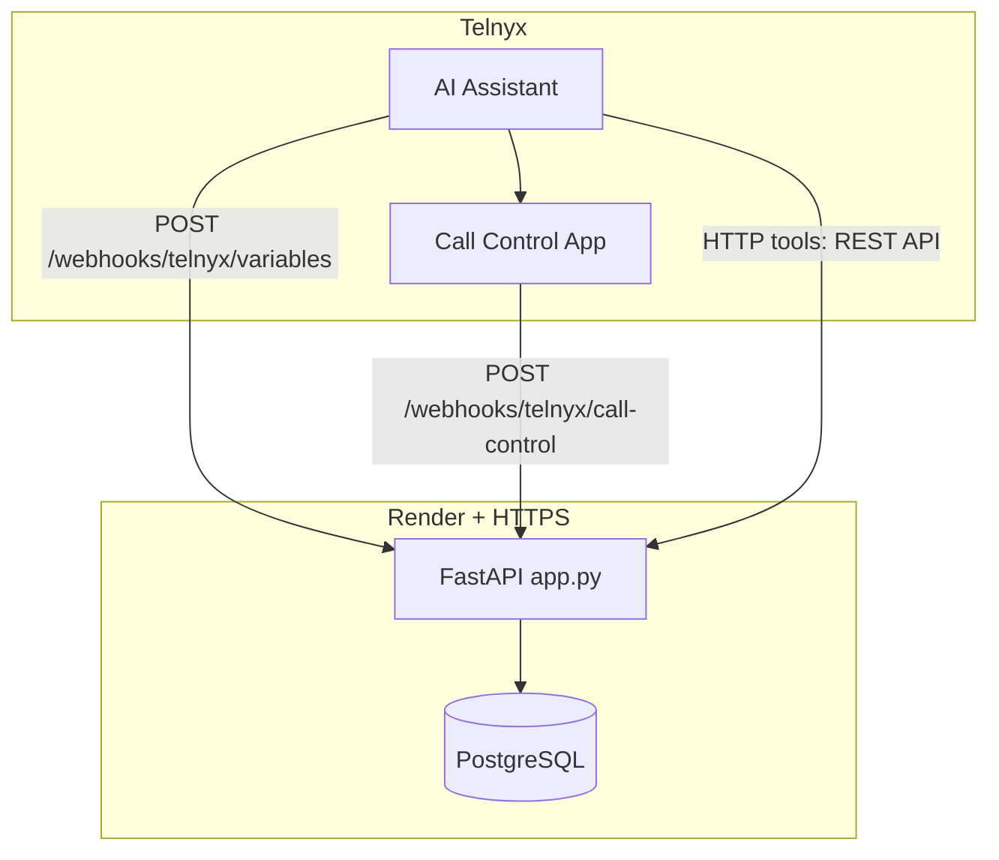

# Telnyx Voice AI — Hanok Table (Restaurant Reservations)

> **Telnyx challenge stack:** Voice AI assistant for **Hanok Table** (demo Korean restaurant), backed by **FastAPI**, **PostgreSQL**, **dynamic webhook variables**, **Call Control** outbound reminders, and a suggested **MCP** tool mapping (see [`telnyx_restaurant/mcp_server/README.md`](telnyx_restaurant/mcp_server/README.md)).

[](https://developers.telnyx.com/)
[](https://modelcontextprotocol.io/)
[](https://fastapi.tiangolo.com/)
[](https://render.com/)
[](https://www.python.org/)
[](LICENSE)

---

## Overview

This repository is a **single Python service** (`telnyx_restaurant`) that:

- Exposes a **REST API** for reservations (create, lookup, partial update, status/cancel) with **menu-backed pre-orders** and pricing.
- Serves **Telnyx webhooks**: dynamic **variables** for assistant instructions and **Call Control** callbacks for outbound reminder TTS.
- Ships a **static site** (landing, reserve-online form, reservation status page) and a **server-rendered admin calendar** (active bookings only; cancelled rows are hidden from the grid).

**Data:** Synthetic demo only — use for labs and reviewer demos, not production PII.

---

## Architecture



| Layer | Role |
|-------|------|
| **`app.py`** | FastAPI entrypoint: lifespan (DB init + demo seed), mounts `/assets`, public HTML routes. |
| **`routers/reservations.py`** | `/api/reservations` — CRUD-style reservation API, menu, lookup, **PATCH `/amend`** (body includes `confirmation_code`), pre-order aware updates. |
| **`routers/webhook.py`** | `POST /webhooks/telnyx/variables` (personalization JSON), `POST /webhooks/telnyx/call-control` (`call.answered` → speak reminder script). |
| **`routers/admin.py`** | `GET /admin/reservations` — calendar UI + JSON for chips (optional `?token=` if `ADMIN_DASHBOARD_TOKEN` is set). |
| **`schemas_res.py`** | Pydantic models: tolerant Telnyx payloads (nested wrappers, pre-order aliases, phone coercion). |
| **`menu_catalog.py`** | Demo menu items, id resolution, fuzzy names for voice/API. |
| **`preorder_calc.py`** | Serialize pre-order lines, **7% pre-order discount** on food subtotal. |
| **`reminders.py`** | After create: delayed **POST** to Telnyx **`/v2/calls`** with `client_state`; speak uses webhook + `speak` action. |
| **`db.py` / `models.py`** | SQLAlchemy + `Reservation` + optional **`table_slot_inventory`** (per-slot table-size counts). |
| **`table_allocation.py`** | Greedy single-table fit, then bounded combination (up to `HANOK_MAX_TABLES_PER_PARTY`) across multi-slot duration. |
| **`seating_service.py`** | Locks inventory rows (`SELECT … FOR UPDATE`), books or waitlists on create, releases + VIP-ordered **waitlist promotion** on cancel. |
Remarks:
- **Optional:** set **`HANOK_TABLE_ALLOCATION_ENABLED=1`** (see `.env.example`).
- **`GET /api/reservations/seating/availability?date=YYYY-MM-DD`** returns per–grid-bucket effective counts (UTC day) when allocation is enabled.
- **Amend / time change:** changing `party_size` or `starts_at` via PATCH does **not** automatically re-seat yet (cancel + re-book releases capacity correctly).

---

## REST API (prefix `/api/reservations`)

| Method | Path | Purpose |
|--------|------|---------|
| GET | `/menu/items` | Public menu (`id`, prices, EN/KO names) for pre-order tools and web form. |
| GET | `/seating/availability` | When **`HANOK_TABLE_ALLOCATION_ENABLED=1`**: `?date=YYYY-MM-DD` — per-slot table inventory snapshot (UTC). |
| GET | `` | List reservations (JSON). |
| POST | `` | Create reservation (JSON or form). Accepts nested Telnyx shapes; normalizes **E.164** phone. Optional **`duration_minutes`**, **`waitlist_if_full`** (default true), **`guest_priority`** (`normal` / `vip`); preorder ≥ **`HANOK_VIP_PREORDER_CENTS`** upgrades waitlist priority. |
| GET | `/lookup` | **Primary lookup:** `guest_name` + **`phone` or `guest_phone`** (empty `phone=` is OK if `guest_phone` is set). |
| GET | `/lookup-by-phone` | Legacy: phone (+ optional `guest_name` if ambiguous). |
| GET | `/by-code/{code}` | Fetch by **HNK-…** code (real code in path; not literal `{{code}}`). |
| PATCH | `/amend` | **Body:** **`confirmation_code`** (or `code`, `next_reservation_code`, …) **or** numeric **`id` / `reservation_id`** (same as lookup response’s `id`, e.g. `11`), **plus** fields to change: `preorder` / `items`, **`party_size`**, **`starts_at`**, **`status`**, guest fields, etc. Use when the tool posts JSON instead of `PATCH /{id}`. |
| PATCH | `/by-code/{code}` | Partial update (party size, time, pre-order, guest fields). Ignores JSON `null` on required DB columns (e.g. does not clear `party_size`). |
| PATCH | `/by-code/{code}/status` | **Status** (`{"status":"cancelled"}` or **`?cancel=1`**) and, if needed, the **same fields as `/amend`** (party_size, starts_at, preorder, …) when Telnyx tools are bound to `…/status` only. |
| PATCH | `/{id}` | Partial update by numeric id (id must be real; not `{{reservation_id}}`). |
| PATCH | `/{id}/status` | Same as **`/by-code/…/status`**: status-only or **full partial update** in the JSON body. |
| GET | `/{id}` | Fetch one row by id. |

**PATCH responses:** Successful PATCH endpoints return **`X-Hanok-Reservation-Changed: 1`** when any stored field actually changed, and **`0`** when the body was accepted but matched existing values (no DB write). Voice agents often treat HTTP 200 alone as “updated”; use this header or re-**GET** the row to confirm.

**Pre-orders:** Lines reference **menu_item_id** (or dish names resolved to catalog ids). Stored as JSON on the row with computed subtotal, discount, and total cents. **`preorder: []`** on PATCH is treated as **no change** (voice tools often send an empty list when updating party/time); use **`preorder: null`** to **clear** the cart.

---

## Telnyx webhooks

Configure these **HTTPS URLs** on Mission Control (exact host is yours; example: `https://telnyx.convonetai.com`).

| URL | Purpose |
|-----|---------|
| **`POST .../webhooks/telnyx/variables`** | Return JSON for instruction templates (guest display name, reservation summaries, `next_reservation_code`, etc.) keyed off **caller number** when the row exists in DB. |
| **`POST .../webhooks/telnyx/call-control`** | Call Control events: on **`call.answered`**, decode `client_state` (or fall back to DB by callee), run **TTS speak** with reminder script, optionally hang up after speak ends. |

**Outbound reminder:** When `TELNYX_API_KEY`, `TELNYX_CONNECTION_ID`, and `TELNYX_FROM_NUMBER` are set, a new reservation schedules **`POST https://api.telnyx.com/v2/calls`** after **`HANOK_REMINDER_DELAY_SECONDS`** (default 5s). Set **`HANOK_PUBLIC_BASE_URL`** (or `PUBLIC_BASE_URL` / `RENDER_EXTERNAL_URL`) to your public origin so the dial request can include **`webhook_url`** → `/webhooks/telnyx/call-control` (helps when the Portal connection default points elsewhere).

---

## Static pages & admin

| Route | Description |
|-------|-------------|
| `/`, `/index.html` | Hanok landing; EN/KO; Telnyx AI web component. |
| `/reserve-online` | Pre-order form posting to the API. |
| `/reservation/status` | Lookup by confirmation code (food totals). |
| `/admin/reservations` | **Day / week / month** calendar (UTC) of **non-cancelled** reservations; detail overlay. Optional `?token=` if `ADMIN_DASHBOARD_TOKEN` is set. |
| `/health` | Liveness (`GET` or `POST`). |

---

## Environment variables

| Variable | Description |
|----------|-------------|
| **`DB_URI`** or **`DATABASE_URL`** | SQLAlchemy Postgres URL (`postgresql+psycopg2://…`; `sslmode=require` appended for Render hosts when missing). |
| **`ADMIN_DASHBOARD_TOKEN`** | If set, admin page requires matching `?token=`. |
| **`TELNYX_API_KEY`** / **`TELNYX_API_TOKEN`** | Bearer token for Telnyx REST (outbound call + speak). |
| **`TELNYX_CONNECTION_ID`** | Voice API **Call Control application** id used with `POST /v2/calls`. |
| **`TELNYX_FROM_NUMBER`** | Outbound caller ID (**+E.164**). |
| **`HANOK_REMINDER_DELAY_SECONDS`** | Seconds before placing reminder call (1–300; default 5). |
| **`HANOK_PUBLIC_BASE_URL`** | Public site origin **without** trailing slash (e.g. `https://telnyx.convonetai.com`) for per-dial `webhook_url`. |
| **`PUBLIC_BASE_URL`**, **`RENDER_EXTERNAL_URL`** | Fallbacks for the same origin if `HANOK_PUBLIC_BASE_URL` is unset. |
| **`HANOK_RESERVATION_VERBOSE_LOG`** | If `1` / `true`, logs truncated PATCH bodies for **`/amend`** and **`…/status`** at INFO. |
| **`RENDER_GIT_COMMIT`** / **`APP_GIT_REVISION`** | Set by host or locally; logged at startup for deploy fingerprint. |

See [`telnyx_restaurant/.env.example`](telnyx_restaurant/.env.example) for a template.

---

## Repository structure

```
8.telnyx/
├── README.md
├── LICENSE
├── Procfile
├── requirements.txt          # delegates to telnyx_restaurant/requirements.txt
└── telnyx_restaurant/
    ├── app.py
    ├── config.py
    ├── db.py
    ├── models.py
    ├── seed.py
    ├── phone_normalize.py
    ├── menu_catalog.py
    ├── preorder_calc.py
    ├── reminders.py
    ├── schemas_res.py
    ├── webhook_payload.py
    ├── routers/
    │   ├── admin.py
    │   ├── reservations.py
    │   └── webhook.py
    ├── templates/
    │   └── admin_reservations.html
    ├── static/
    │   ├── index.html
    │   ├── reserve_online.html
    │   └── reservation_status.html
    └── mcp_server/
        └── README.md           # Suggested MCP tool ↔ REST mapping
```

---

## Deployment (Render)

1. **Web service** from repo **root**; start: `uvicorn telnyx_restaurant.app:app --host 0.0.0.0 --port $PORT` (or use `Procfile`).
2. Attach **PostgreSQL**; set **`DB_URI`** on the web service.
3. Custom domain (e.g. Cloudflare CNAME → Render).
4. Telnyx Portal: point **dynamic variables** webhook and **Call Control** webhook (if not overridden per-call) to this app; configure HTTP tools with **fixed URLs** — avoid leaving `{{reservation_id}}` unbound; prefer **`PATCH /api/reservations/amend`** + **`confirmation_code`** in JSON for updates.

**Checklist:** If `/` 404s but `/health` works, confirm build includes `static/index.html` and **Root Directory** on Render is empty (repo root).

---

## Local development

```bash
git clone https://github.com/hjleepapa/8-telnyx.git
cd 8-telnyx
python -m venv .venv
source .venv/bin/activate   # Windows: .venv\Scripts\activate
pip install -r requirements.txt
cp telnyx_restaurant/.env.example telnyx_restaurant/.env
uvicorn telnyx_restaurant.app:app --reload --host 0.0.0.0 --port 8080
```

- **Home:** http://localhost:8080/
- **Health:** http://localhost:8080/health
- **Variables webhook (try):** `POST http://localhost:8080/webhooks/telnyx/variables` with `{"caller_number": "+15551234567"}`

Without `DB_URI`, the app runs but DB-backed routes return **503** where applicable.

**Tests:** `python3 -m pytest telnyx_restaurant/tests -v` (table allocation + sqlite-backed seating flows).

**Reservation lab (optional):** set `HANOK_RESERVATION_LAB=1`, then open **`/reservation-lab`** (if `ADMIN_DASHBOARD_TOKEN` is set, add **`?token=…`**). Browser UI drives create / lookup / PATCH `/amend` with preset JSON (e.g. nested `body` + `confirmation_code: null`). Complements **`/docs`**.

---

## MCP

The in-repo MCP server is documented as a **suggested tool surface** aligned with the REST API above. Implement or wire tools per [Telnyx MCP guidance](https://developers.telnyx.com/); mapping table: [`telnyx_restaurant/mcp_server/README.md`](telnyx_restaurant/mcp_server/README.md).

---

## Security & ops

- Synthetic data only for public demos.
- Do not commit `.env`; rotate DB credentials if exposed.
- Scanner noise (`/.env`, `/.git`, etc.) returning **404** is expected.

---

## License

MIT — see [LICENSE](LICENSE).

**Repository:** [github.com/hjleepapa/8-telnyx](https://github.com/hjleepapa/8-telnyx)
